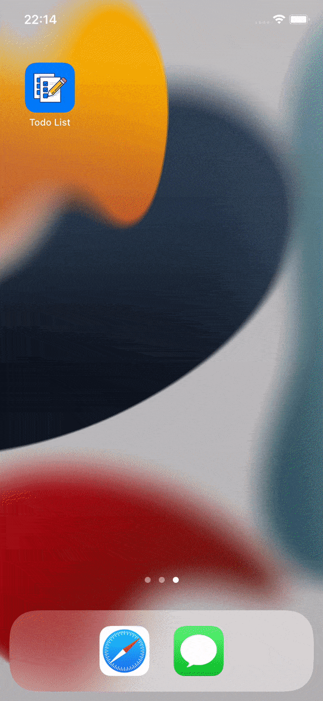
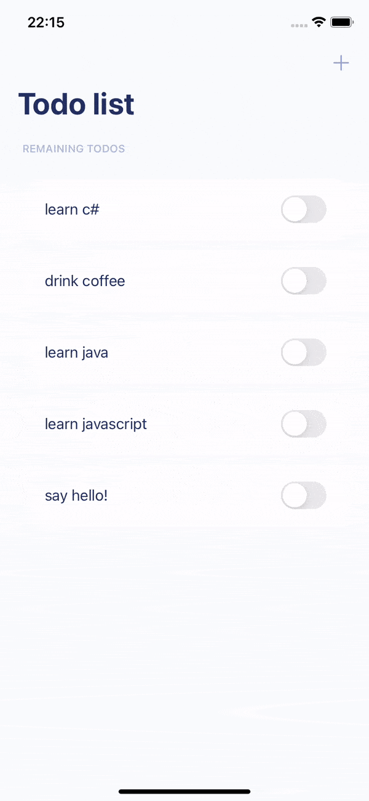
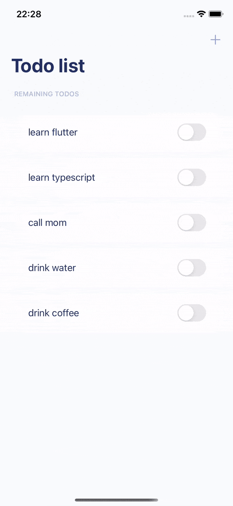

  

   <h2 align="center">
    Simple IOS Todo List
  </h2>

  
  

Simple native IOS todo list built with Swift + Storyboard with the purpose to learn about layout creation and data storing with UserDefaults.

The application persists on UserDefaults the todo items created by the user and they can be changed status do completed or removed when swipe right

# Preview

  
  
  

## Thanks

with ❤️ by Gustavo
